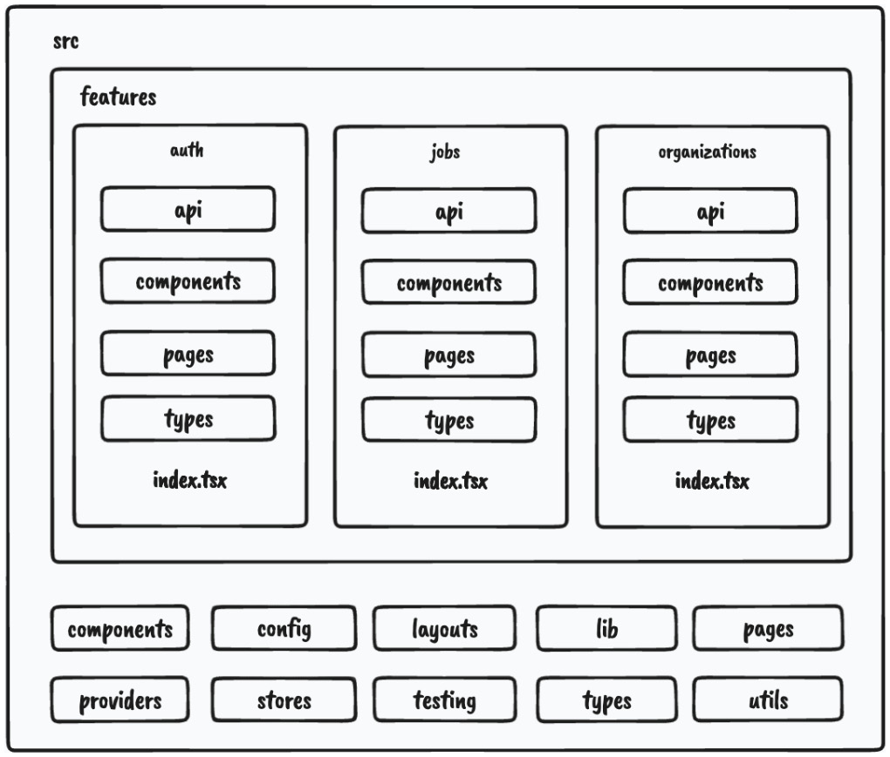
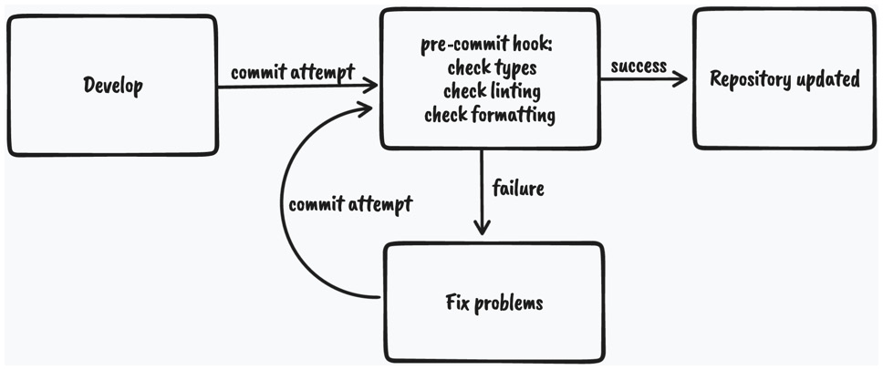
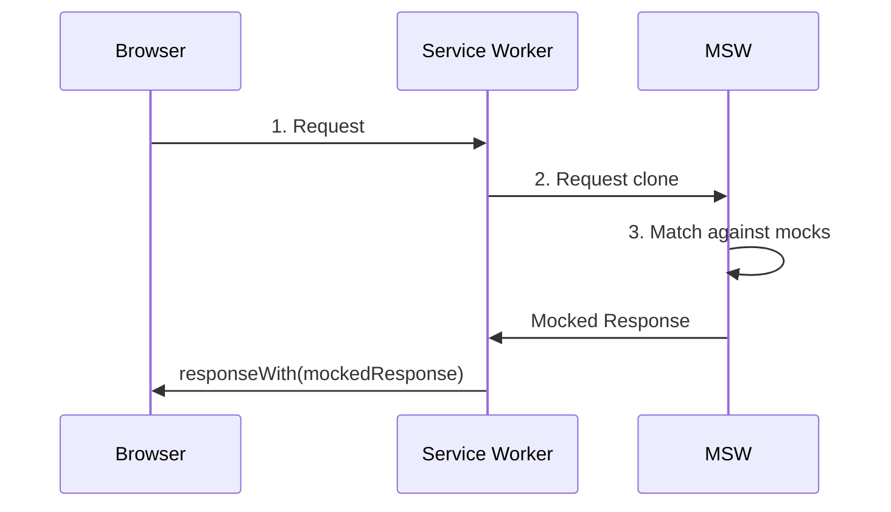
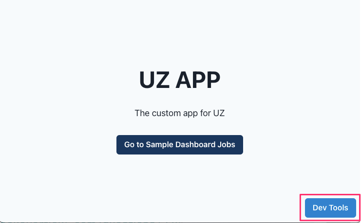
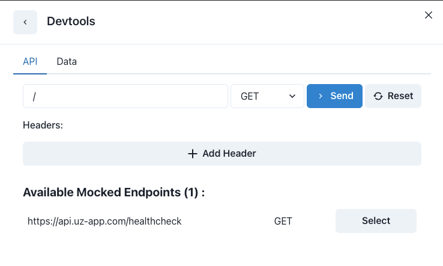
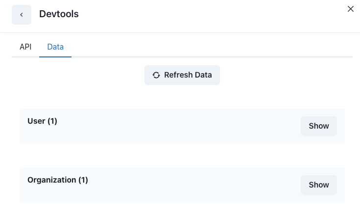

# How I setup the project

Table of Content
<!-- toc -->

- [Frontend](#frontend)
  * [NextJS](#nextjs)
    + [Install Nextjs](#install-nextjs)
    + [Nestjs Folder Structure (Before V13)](#nestjs-folder-structure-before-v13)
    + [Nestjs Folder Structure (After V13)](#nestjs-folder-structure-after-v13)
    + [Setup the Charka UI](#setup-the-charka-ui)
  * [Strict Node Version](#strict-node-version)
  * [TypeScript](#typescript)
  * [ESLint](#eslint)
  * [Prettier](#prettier)
  * [Pre-commiting](#pre-commiting)
  * [Story Book](#story-book)
    + [Storybook Configuration](#storybook-configuration)
    + [Storybook scripts](#storybook-scripts)
    + [Documenting components](#documenting-components)
    + [Button stories](#button-stories)
  * [Mocking API](#mocking-api)
    + [Why is mocking useful?](#why-is-mocking-useful)
    + [Workign with MSW](#workign-with-msw)
- [Trouble Shooting](#trouble-shooting)
  * [FRONTEND](#frontend)
    + [1. **Issue**: Run `npm run lint` error when checking the `app` or `pages` on the nextjs project.](#1--issue-run-npm-run-lint-error-when-checking-the-app-or-pages-on-the-nextjs-project)
    + [2. **Issue**: `npm run lint` error for storybook render files](#2-issue-npm-run-lint-error-for-storybook-render-files)
    + [3. **Issue**: We would like reformat only the changed files.](#3-issue-we-would-like-reformat-only-the-changed-files)
    + [4. **ISSUE**: Tsconfig is not property?](#4-issue-tsconfig-is-not-property)
    + [5. **ISSUE**: require(..) in condition does not work in es6 import/export](#5-issue-require-in-condition-does-not-work-in-es6-importexport)
    + [6. **ISSUE**: I would like to make the TOC (Table of content) for the markdown file](#6-issue-i-would-like-to-make-the-toc-table-of-content-for-the-markdown-file)

<!-- tocstop -->

## Frontend

### NextJS
*This content is copy/learn from the Ebook: React Application Architecture for Production by Adam Giese see the github repo [here](https://github.com/PacktPublishing/React-Application-Architecture-for-Production/tree/main)*

#### Install Nextjs

```sh
npx create-next-app@latest uz-app --typescript
```

There are a couple of things that are specific to Next.js. Let’s look at the following file and folder structure of a simple Next.js application:

```
- .next
- public
- src
  - pages
    - _app.tsx
    - index.tsx
- next.config.js
- package.json
```

Let’s analyze each file and folder one by one:

- `.next`: Contains production-ready files generated by running the build command of Next.js.

- `public`: Contains all static assets of the application.
`src/pages`: This is a special folder in Next.js where all pages defined here become available at corresponding routes. This is possible thanks to the filesystem-based routing system. The pages folder can also live in the root of the project, but it is nice to keep everything in the src folder.

- `src/pages/_app.tsx`: The _app.tsx file is a special file that exports a React component that wraps every page when rendered. By wrapping pages with this special component, we can add custom behavior for our application, such as adding any global configurations, providers, styles, layouts, and more to all the pages.

- `src/pages/index.tsx`: This is how we declare pages of the application. This shows how the root page is defined. 

- `next.config.js`: This is where we can extend the default functionalities such as Webpack configuration and other things in a simple way.

- `package.json`: Every Next.js application includes the following npm scripts:
    - `dev`: Starts a development server on localhost:3000
    - `build`: Builds the application for production
    - `start`: Starts the production build on localhost:3000


#### Nestjs Folder Structure (Before V13)

**NOTE** This is structure for the Nextjs [Page Layout](https://nextjs.org/docs/pages/building-your-application/routing/pages-and-layouts)


<p align="center">
  <kbd>
      
  </kbd>
</p>

As we already mentioned, React is very flexible when it comes to project structure.

Some of the benefits of having a good project structure are as follows:

- Separation of concerns
- Easier refactors
- Better reasoning about the code base
- Easier for larger teams to work on the code base simultaneously

Let’s see what the feature-based project structure looks like.

NOTE

We will focus on the src folder only since, from now on, most of the code base lives there.

Here is the structure of our src folder:


```
- components // (1)
- config // (2)
- features // (3)
- layouts // (4)
- lib // (5)
- pages // (6)
- providers // (7)
- stores // (8)
- testing // (9)
- types // (10)
- utils // (11)
```
Let’s analyze each of the folders, one by one:

- `components`: Contains all shared components that are used across the entire application.
- `config`: Contains the application configuration files.
- `features`: Contains all the feature-based modules. We will analyze this one in more detail in the following section.
- `layouts`: Contains different layouts for the pages.
- `lib`: Contains configurations for different libraries that are used in our application.
- `pages`: Contains the pages of our application. This is where Next.js will look for pages in the filesystem-based routing.
- `providers`: Contains all application providers. For example, if our application uses many different providers for styling, state, and so on, we can combine them here and export a single application provider with which we can wrap our _app.tsx to make all the providers available on all the pages.
- `stores`: Contains all global state stores that are used in the application.
- `testing`: Contains test-related mocks, helpers, utilities, and configurations.
- `types`: Contains base TypeScript type definitions that are used across the application.
- `utils`: Contains all shared utility functions.

There is nothing wrong with grouping files in folders based on their types. However, once the application starts to grow, it becomes more difficult to reason about and maintain the code base because there are too many files of a single type.

**Features**

To scale the application in the easiest and most maintainable way, we want to keep most of the application code inside the features folder, which should contain different feature-based things. Every feature folder should contain domain-specific code for a given feature. This will allow us to keep functionalities scoped to a feature and not mix its declarations with the shared things. This is much easier to maintain than a flat folder structure with many files.

Let’s look at one of our feature folders, which has the following structure:

```
- api // (1)
- components // (2)
- types // (3)
- index.ts // (4)
```


- `api`: Contains the API request declarations and API hooks related to a specific feature. This makes our API layer and the UI layer separate and reusable.

- `components`: Contains all components that are scoped to a specific feature.

- `types`: This contains the TypeScript type definitions for a specific feature.

- `index.ts`: This is the entry point of every feature. It behaves as the public API of the feature, and it should only export things that should be public for other parts of the application.

**Import the Feature Module**
One more thing we can configure is enforcing developers to import features code via the index.ts file, like so:


```js
import {JobsList} from '@/features/jobs'
```
We shouldn’t do this:
```js
import {JobsList} from '@/features/jobs/components/jobs-
  list'
```
This will give us a better picture of which dependency is used where and where it comes from. Also, if the feature gets refactored, it doesn’t have to impact any external parts of the application where that component is used.

We can constrain our code by having the following ESLint rule in the .eslintrc.js file:

```js
rules: {
    'no-restricted-imports': [
      'error',
      {
        patterns: ['@/features/*/*'],
      },
    ],
    'import/no-cycle': 'error',
      … rest of the eslint rules
}
```

The `no-restricted-imports` rule will add constraints to imports from other features by erroring if any violations in the preceding pattern are detected.

Things from a feature can only be consumed if they’re exported from the index.ts file of that feature. This will force us to explicitly make something in a feature publicly available.

If we decide to use features this way, we should also include the `import/no-cycle` rule to prevent cyclic dependencies where Feature A imports things from Feature B and vice versa. If this happens, that means something with the application design is wrong and it needs to be restructured.

#### Nestjs Folder Structure (After V13)

From Nextjs v13, they provide the `app router`, see more detail [here](https://nextjs.org/docs/app/building-your-application/routing#the-app-router). Basically, we use `app` folder for routing instead of the `pages` folder.

We have to look the  [Project Organization and File Colocation](https://nextjs.org/docs/app/building-your-application/routing/colocation)


#### Setup the Charka UI
From the [documentation](https://chakra-ui.com/getting-started), we can see that we need to install the following dependencies:

```sh
npm i @chakra-ui/react @emotion/react @emotion/styled framer-motion
```

For the nextjs we need to have a look on [the particular document](https://chakra-ui.com/getting-started/nextjs-guide) too.

### Strict Node Version
We want to make sure that everyone on the team uses the same Node version. This will prevent any potential issues that might occur due to different Node versions.

We can do this by adding the following to the package.json file:
```json
"engines": {
  "node": ">=16.0.0",
  "npm": ">=8.0.0"
}
```

We could add the strict node version by `.npmrc` file:
```sh
# .npmrc
engine-strict=true
```

We could also use the .nvmrc file to specify the Node version. However, this is not recommended since it is not supported by all package managers.

```sh
echo "v16.0.0" > .nvmrc
nvm use
```


### TypeScript

Our project already has TypeScript configured. The TypeScript configuration is defined in the tsconfig.json file at the root of the project. It allows us to configure how strict we want it to be based on our needs:


```json
{
  "compilerOptions": {
    "target": "es5",
    "lib": ["dom", "dom.iterable", "esnext"],
    "allowJs": true,
    "skipLibCheck": true,
    "strict": true,
    "forceConsistentCasingInFileNames": true,
    "noEmit": true,
    "esModuleInterop": true,
    "module": "esnext",
    "moduleResolution": "Node",
    "resolveJsonModule": true,
    "isolatedModules": true,
    "jsx": "preserve",
    "incremental": true,
    "baseUrl": ".",
    "paths": {
      "@/*": ["./src/*"]
    }
  },
  "include": ["next-env.d.ts", "src"],
  "exclude": ["node_modules"]
}
```

Here’s what each line means:

- `"target": "es5"`: This specifies the version of JavaScript that the TypeScript code will be compiled to. In this case, it is set to es5, which is an older version of JavaScript that is widely supported by browsers.
- `"lib": ["dom", "dom.iterable", "esnext"]`: This specifies the library files that will be included in the compilation. In this case, it includes the dom and dom.iterable libraries for working with the Document Object Model (DOM) and the esnext library for using newer JavaScript features.
- `"allowJs": true`: This allows JavaScript files to be included in the compilation.
- `"skipLibCheck": true`: This skips type checking of declaration files.
- `"strict": true`: This enables all strict type checking options.
- `"forceConsistentCasingInFileNames": true`: This ensures that the casing of file names is consistent.
- `"noEmit": true`: This prevents the compiler from emitting any output files.
- `"esModuleInterop": true`: This enables interoperability between CommonJS and ES Modules via the creation of namespace objects for all imports.
- `"module": "esnext"`: This specifies the module code generation. In this case, it is set to esnext, which means that the latest module syntax will be used.
- `"moduleResolution": "bundler"`: This specifies how module imports are resolved. In this case, it is set to bundler, which means that a bundler like webpack or rollup will be used to resolve modules.
- `"resolveJsonModule": true`: This allows importing JSON files as modules.
- `"isolatedModules": true`: This ensures that each file can be transpiled independently without relying on type information from other files.
- `"jsx": "preserve"`: This specifies how JSX syntax should be handled. In this case, it is set to preserve, which means that JSX syntax will be preserved in the output and not transformed.
- `"incremental": true`: This enables incremental compilation by reusing information from previous compilations to speed up subsequent builds.

There is a thing that was also provided:

```json
"baseUrl": ".",
"paths": {
    "@/*": ["./src/*"]
}
```
This will tell the TypeScript compiler that anything imported via @/* will refer to the src folder.

Previously, we had to perform messy imports, like so:

```js
import { Component } from '../../../components/component'
```

Now, we can import components like so:


```js
import { Component } from '@/components/component'
```
No matter how many nested levels we have, we can always import with absolute paths, and we will not be required to change our import statement should we decide to move the consumer file somewhere else.

### ESLint
Linting is a process where linters analyze source code and detect any potential issues in the code base.

We will be using ESLint, which is the most popular linting tool for JavaScript. It can be configured with different plugins and rules to adapt the linter to our application’s needs.

The ESLint configuration is defined in the `.eslintrc.js` file at the root of the project. We can add different rules, extend them with different plugins, and override which files to apply the rules to so that they suit our application’s needs.

Sometimes, we don’t want to lint every folder and file, so we can tell ESLint to ignore folders and files by defining them in the `.eslintignore` file.

ESLint has great integration with editors and IDEs so that we can see any potential issues in the file while we are coding.

To run our linter, we have defined the linting script in `package.json`:


```json
"lint": "eslint --ext .ts,.tsx ./src",
```

By running npm run lint, we will lint every .ts and .tsx file in the src directory, and the linter will notify us about any potential issues.

### Prettier
Prettier is a great tool for formatting code. It enforces a consistent coding style across the entire code base. By utilizing the “format on save” feature in our IDE, we can automatically format the code based on the configuration provided in the .prettierrc file. It will also give us good feedback when something is wrong with the code. If it doesn’t auto-format, something is wrong with the code and it needs to be fixed.

Prettier comes with a default configuration out of the box. We can override this by creating the `.prettierrc` file and modifying the configuration.

Just as with ESLint, sometimes, there are files we do not want to auto-format. We can tell Prettier to ignore files and folders by adding them to the `.prettierignore` file.

To run Prettier, we have defined a couple of scripts in `package.json`:


```json
"prettier": "prettier \"**/*.+(json|ts|tsx)\"",
"format:check": "npm run prettier -- --check",
"format:fix": "npm run prettier -- --write",
```

As we can see, we can run `npm run format:check` to just check the formatting without trying to fix it. If we want to fix it, then we can run `npm run format:fix`, which will modify the files that need to be fixed.

### Pre-commiting
Having static code analysis tools such as TypeScript, ESLint, and Prettier is great; we have configured them and can run individual scripts whenever we make some changes to ensure everything is in the best order.

However, there are some drawbacks. Developers can forget to run all checks before committing to the repo, which can still bring problematic and inconsistent code to production.

Fortunately, there is a solution that can fix this problem: whenever we try to commit to the repository, we want to run all checks in an automated way.

<p align="center">
  <kbd>
      
  </kbd>
</p>

Whenever we attempt to commit to the repository, the git pre-commit hook will run and execute the scripts that will do the checking. If all the checks pass, the changes will be committed to the repository; otherwise, we will have to fix the issues and try again.

To enable this flow, we will use `husky` and `lint-staged`:

`husky` is a tool that allows us to run git hooks. We want to run the pre-commit hook to run the checks before committing our changes.

`lint-staged` is a tool that allows us to run those checks only on files that are in the staging area of Git. This improves the speed of code checking since doing that on the entire code base might be too slow.

We already have these tools installed and configured, but if we didn’t, they could be installed using the following command:


```sh
npm install –-save-dev husky lint-staged
```
Then, we would need to enable Git hooks:


```sh
npx husky install
```
Then, we would need to create the pre-commit hook:


```sh
npx husky add .husky/pre-commit "npx lint-staged"
```

The Husky pre-commit hook will run lint-staged. Then, we would need to define what commands lint-staged should run inside the lint-staged.config.js file:


```js
module.exports = {
  '*.{ts,tsx}': [
    'npm run lint',
    "bash -c 'npm run types:check'",
    'npm run format:check',
  ],
};
```
If we try to commit code that contains any violations, it will fail and stop us from committing the changes.

⚠️ Run `husky` for the nested folder
- see the tip [here](https://stackoverflow.com/questions/53869155/how-to-run-husky-pre-commit-in-child-directory-only) or more detail at [here](https://scottsauber.com/2021/06/01/using-husky-git-hooks-and-lint-staged-with-nested-folders/)

**Use case**
my frontend folder: `/frontend/uz-app`

```json
# at /frontend/uz-app/package.json
{
  "scripts": {
      // other scripts omitted 
      "prepare": "(cd ../../ && husky install ./frontend/uz-app/.husky && touch ./frontend/uz-app/.husky/pre-commit)"
   }
}
```

At the `./husky/pre-commit` file, add the following content:
```sh
#!/bin/sh
. "$(dirname "$0")/_/husky.sh"
cd ./frontend/uz-app && npx lint-staged 
```

Then add the permission
```sh
chmod +x .husky/pre-commit
```


### Story Book
Storybook is a tool that allows us to develop and test UI components in isolation. We can think of it as a tool for making catalogs of all the components we have. It is great for documenting components. A couple of benefits of using Storybook include the following:

Storybook allows developing components in isolation without the need to reproduce the exact state of the application, allowing developers to focus on the things they are building

Storybook serves as a catalog of UI components allowing all stakeholders to try out the components without using them in the application
Storybook is configured by using the following command:

```sh
npx storybook init
```
This command will install all required dependencies and set up the configuration that resides in the .storybook folder at the root of the project.

#### Storybook Configuration
We already have Storybook installed, so let’s look at the configuration, which has two files.

The first file contains the main configuration, which controls how the Storybook server behaves and how it processes our stories. It lives in `.storybook/main.js`:


```js
const path = require('path');
const TsconfigPathsPlugin = require('tsconfig-paths-webpack-plugin');
module.exports = {
  stories: ['../src/**/*.stories.tsx'],
  addons: [
    '@storybook/addon-links',
    '@storybook/addon-essentials',
    '@storybook/addon-interactions',
    '@chakra-ui/storybook-addon',
  ],
  features: {
    emotionAlias: false,
  },
  framework: '@storybook/react',
  core: {
    builder: '@storybook/builder-webpack5',
  },
  webpackFinal: async (config) => {
    config.resolve.plugins = config.resolve.plugins || [];
    config.resolve.plugins.push(
      new TsconfigPathsPlugin({
        configFile: path.resolve(
          __dirname,
          '../tsconfig.json'
        ),
      })
    );
    return config;
  },
};
```
The main configuration contains the following properties:

- `stories`: An array of globs that indicates the locations of our stories.
- `addons`: A list of add-ons used to enhance the default behavior of Storybook.
- `features`: Enables Storybook’s additional features.
- `framework`: Framework-specific configurations.
- `core`: Internal feature configuration.
- `webpackFinal`: Configuration for extending default webpack configuration. We are enabling absolute imports by telling Storybook to use paths from the tsconfig.json file.

The second configuration file controls how the stories are rendered in the UI. This configuration lives in `.storybook/preview.js`:


```js
import { theme } from '../src/config/theme';
export const parameters = {
  actions: { argTypesRegex: '^on[A-Z].*' },
  controls: {
    matchers: {
      color: /(background|color)$/i,
      date: /Date$/,
    },
  },
  controls: { expanded: true },
  chakra: {
    theme,
  },
};
```
Notice how we are passing the theme to the chakra property in parameters. This will enable Chakra theming to be applied to our components in Storybook.

We can optionally export decorators, which will wrap all the stories. It is useful if the components rely on some providers that we want to have available in all stories.

#### Storybook scripts
Our Storybook setup has two npm scripts:

*Running Storybook in development*
To start the development server, we can execute the following command:


`npm run storybook`
The command will open Storybook at http://localhost:6006/.

Building Storybook for production
We can also generate and deploy the stories to be visible without running the development server. To build the stories, we can execute the following command:


`npm run storybook:build`
Generated files can then be found in the storybook-static folder, and they can be deployed anywhere.

Now that we have familiarized ourselves with the setup, it’s time to write the stories for the components.

#### Documenting components
If we recall from the previous section, the configuration in .storybook/main.js has the stories property as follows:


`stories: ['../src/**/*.stories.tsx']`
This means that any file in the src folder that ends with .stories.tsx should be picked by Storybook and treated as a story. With that said, we will co-locate stories next to the components, so the structure for every component will look something like this:


```
components
  my-component
    my-component.stories.tsx
    my-component.tsx
    index.ts
```
We will create our stories based on Component Story Format (CSF), an open standard for writing component examples.

But first, what is a story? According to the CSF standard, a story should represent a single source of truth for a component. We can think of a story as a user story where a component is presented in the corresponding state.

CSF requires the following:

Default exports should define metadata about a component, including the component itself, the component’s name, decorators, and parameters
Named exports should define all stories
Let’s now create the stories for the components.
#### Button stories
To create stories for the Button component, we need to create an src/components/button/button.stories.tsx file.

Then, we can start by adding the required imports:


```js
import { PlusSquareIcon } from '@chakra-ui/icons';
import { Meta, StoryFn } from '@storybook/react';
import { Button, ButtonProps } from './button';
```
Then, we create the meta configuration object:


```js
const meta: Meta = {
  title: 'Components/Button',
  component: Button,
};
export default meta;
```
Notice that we are exporting it as a default export. This is what Storybook requires, according to CSF.

Since we can have multiple stories, we must create a story template:


```js
const Template: StoryFn<ButtonProps> = (props) => (
  <Button {...props} />
);
```
And then we can export the first story:


```js
export const Default = Template.bind({});
Default.args = {
  children: 'Click Me',
};
```
We can pass any props we need to the args object attached to the story, which will be reflected in our stories in Storybook.

We can do the same thing for another story where we want to have a version of Button that has an icon:

```js
export const WithIcon = Template.bind({});
WithIcon.args = {
  children: 'Click Me',
  icon: <PlusSquareIcon />,
};
```
To see the story, let’s execute the following command:


```sh
npm run storybook
```
### Mocking API

#### Why is mocking useful?
Mocking is the process of simulating parts of the system, meaning they are not production-ready but fake versions that are useful for development and testing.

You may ask yourself, Why do we want to bother with setting a mocked API? There are several benefits of having the API mocked:

- `Independence of external services during development`: A web application usually consists of many different parts such as the frontend, the backend, external third-party APIs, and so on. When developing our frontends, we want to be as autonomous as possible without getting blocked by some parts of the system that are not functional. If the API of our application is broken or unfinished, we should still be able to proceed with developing the frontend part of the application.

- `Good for quick prototyping`: Mocked endpoints allow us to prototype the application quicker since they don't require any additional setup such as the backend server, database, and so on. Very useful for building proofs of concept (POCs) and minimum viable product (MVP) applications.

- `Offline development`: Having mocked API endpoints allows us to develop our application without an internet connection.

- `Testing`: We do not want to hit our real services while testing our frontends. That’s where mocked APIs become useful. We can build and test the entire functionality as if we were building it against a real API and then switch to the real one when in production.

For testing our API endpoints, we will use the Mock Service Worker (MSW) library, a great tool that allows us to mock endpoints in a very elegant way.

#### Workign with MSW



**Init & Setup MSW**
```sh
npx msw init public/ --save
npm install msw @mswjs/data msw-devtools --save-dev
```

Set more setup information at [here](https://mswjs.io/docs/getting-started/mocks)

At `src/testing/mocks/browser.ts`
```js
import { setupWorker } from 'msw';
import { handlers } from './handlers';
export const worker = setupWorker(...handlers);
```

At `src/testing/mocks/server.ts`
```js
import { setupServer } from 'msw/node';
import { handlers } from './handlers';
export const server = setupServer(...handlers);
```

At `src/testing/mocks/initialize.ts`:
```js
import { IS_SERVER } from '@/config/constants';
const initializeMocks = () => {
  if (IS_SERVER) {
    const { server } = require('./server');
    server.listen();
  } else {
    const { worker } = require('./browser');
    worker.start();
  }
};
initializeMocks();
```

Integrate Mock at `src/lib/msw.tsx`:
```js
import { MSWDevTools } from 'msw-devtools';
import { ReactNode } from 'react';
import { IS_DEVELOPMENT } from '@/config/constants';
import { db, handlers } from '@/testing/mocks';
export type MSWWrapperProps = {
  children: ReactNode;
};
require('@/testing/mocks/initialize');
export const MSWWrapper = ({
  children,
}: MSWWrapperProps) => {
  return (
    <>
      {IS_DEVELOPMENT && (
        <MSWDevTools db={db} handlers={handlers} />
      )}
      {children}
    </>
  );
};
```

Link to Nextjs App at `src/pages/_app.tsx`:
```js
import dynamic from 'next/dynamic';
import { API_MOCKING } from '@/config/constants';
import { MSWWrapperProps } from '@/lib/msw';

// ...
const MSWWrapper = dynamic<MSWWrapperProps>(() =>
  import('@/lib/msw').then(({ MSWWrapper }) => MSWWrapper)
);


// ...
return (
    <AppProvider>
      {API_MOCKING ? (
        <MSWWrapper>{pageContent}</MSWWrapper>
      ) : (
        pageContent
      )}
    </AppProvider>
  );

```

Try with first handler `src/testing/mocks/handlers/index.ts`:
```js
import { rest } from 'msw';
import { API_URL } from '@/config/constants';
export const handlers = [
  rest.get(`${API_URL}/healthcheck`, (req, res, ctx) => {
    return res(
      ctx.status(200),
      ctx.json({ healthy: true })
    );
  }),
];
```

Config memory db at `src/testing/mocks/db.ts`:
It will support db operator like `db.job.{findFirst|findMany|create|update|delete}`
```js
import { factory, primaryKey } from '@mswjs/data';
import { uid } from '@/utils/uid';
const models = {
  user: {
    id: primaryKey(uid),
    createdAt: Date.now,
    email: String,
    password: String,
    organizationId: String,
  },
  organization: {
    id: primaryKey(uid),
    createdAt: Date.now,
    adminId: String,
    name: String,
    email: String,
    phone: String,
    info: String,
  },
  job: {
    id: primaryKey(uid),
    createdAt: Date.now,
    organizationId: String,
    position: String,
    info: String,
    location: String,
    department: String,
  },
};
export const db = factory(models);
```

Populate data to db from test_data file at `src/testing/mocks/seed-db.ts`:
```js
import { db } from './db';
import { testData } from '../test-data';
export const seedDb = () => {
  const userCount = db.user.count();
  if (userCount > 0) return;
  testData.users.forEach((user) => db.user.create(user));
  testData.organizations.forEach((organization) =>
    db.organization.create(organization)
  );
  testData.jobs.forEach((job) => db.job.create(job));
};
```

and init the db at `src/testing/mocks/initialize.ts`:
```js
import { IS_SERVER } from '@/config/constants';
import { seedDb } from './seed-db';
const initializeMocks = () => {
  if (IS_SERVER) {
    const { server } = require('./server');
    server.listen();
  } else {
    const { worker } = require('./browser');
    worker.start();
  }
  seedDb();
};
initializeMocks();
```

After setup and run project with `npm run dev` we have
<p align="center">
  <kbd>
      
  </kbd>
</p>
<p align="center">
  <kbd>
      
  </kbd>
</p>
<p align="center">
  <kbd>
      
  </kbd>
</p>

## Trouble Shooting
### FRONTEND
#### 1.  **Issue**: Run `npm run lint` error when checking the `app` or `pages` on the nextjs project.

Resolve: default use `next lint`, we should use `eslint` instead

#### 2. **Issue**: `npm run lint` error for storybook render files
```
(node:92683) ExperimentalWarning: The ESM module loader is experimental.
internal/modules/run_main.js:54
    internalBinding('errors').triggerUncaughtException(
                              ^

Error [ERR_UNSUPPORTED_ESM_URL_SCHEME]: Only file and data URLs are supported by the default ESM loader
    at Loader.defaultResolve [as _resolve] (internal/modules/esm/resolve.js:727:11)
    at Loader.resolve (internal/modules/esm/loader.js:97:40)
    at Loader.getModuleJob (internal/modules/esm/loader.js:243:28)
    at ModuleWrap.<anonymous> (internal/modules/esm/module_job.js:46:40)
    at link (internal/modules/esm/module_job.js:45:36) {
  code: 'ERR_UNSUPPORTED_ESM_URL_SCHEME'
```
Resolve: Add the ignore pattern to the `.eslintignore` file

#### 3. **Issue**: We would like reformat only the changed files.
So we would like to run the command as below:
```sh
npx prettier --write $(git diff --staged --name-only --diff-filter d | grep  -E "\.js|\.ts" | xargs) 
```
But we got the error:
```
[error] No files matching the pattern were found: "frontend/uz-app/package.json".
[error] No files matching the pattern were found: "frontend/uz-app/src/providers/app.tsx".
```

Resolve: The reason is that the `git diff` command need to return the relative path, so we need to add the `--relative` option to the `git diff` command:
```sh
prettier --write $(git diff --staged --name-only --relative --diff-filter d | grep  -E "\.js|\.ts|\.css|\.scss|\.sass" | xargs)
```

#### 4. **ISSUE**: Tsconfig is not property?
Resolve: `npx tsc --traceResolution` to see the error 

The command `npx tsc --traceResolution` is used to run the TypeScript compiler (`tsc`) with the `--traceResolution` flag. The `npx` command is used to execute a command from a package that is not installed globally, in this case, the TypeScript compiler.

The `--traceResolution` flag is used to provide detailed information about how the TypeScript compiler resolves module imports. When this flag is used, the compiler will output information about each module import it encounters, including the file path of the imported module and any relevant configuration options that were used to resolve the import.

This can be useful for debugging issues with module resolution, such as when a module cannot be found or when the wrong version of a module is being imported. By using the `--traceResolution` flag, you can see exactly how the compiler is resolving each import and identify any issues that may be causing problems.

#### 5. **ISSUE**: require(..) in condition does not work in es6 import/export
```js
 const { server } = require('./server');
    server.listen();
```

Resolve: using `import('lib').then()` instead
```js
    import ('./server').then(({server}) => {
        server.listen();
    });
```

#### 6. **ISSUE**: I would like to make the TOC (Table of content) for the markdown file

Resolve: using the `markdown-toc` package
```sh
npm install markdown-toc --save-dev
```

For example, incase you would like to make the TOC for the `README.md` file, you need to add the following content to the `README.md` file:
```md
<!-- toc -->
```

Then add the script to the `package.json` file
```json
"scripts": {
    "toc": "markdown-toc -i README.md"
}
```

Then run the command `npm run toc` to generate the TOC for the `README.md` file.

